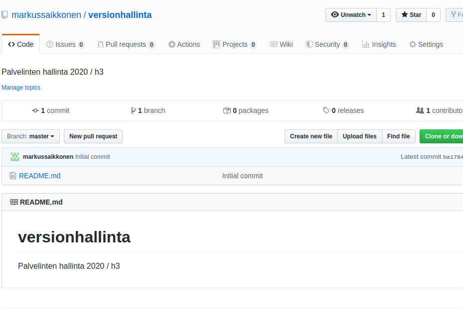
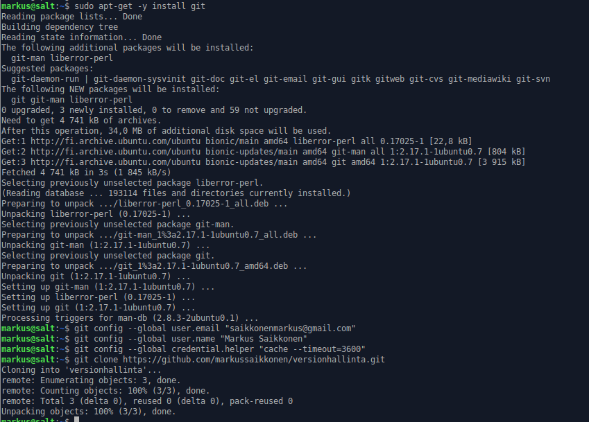
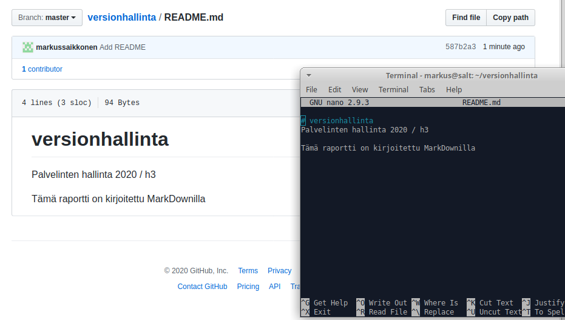

# versionhallinta
Palvelinten hallinta 2020 / h3

Tämä raportti on kirjoitettu MarkDownilla

MarkDownin käytön edellytyksenä on raportille luotu Git repository eli varasto. 
Käytin Linux-palvelimet 2020-kurssilla luomaani Git-tunnusta, jonne loin repositoryn "Versionhallinta".

Asensin gitin paikallisesti, konfiguroin omat käyttäjätiedot sekä salasana-asetukset 

"Kloonasin" Git-repositoryni terminaaliin $ git clone https://github.com/markussaikkonen/versionhallinta.git 
Muokkasin README.md-tiedostoa ja päivitin selaimen.

MarkDown ja Git toimivat onnistuneesti. 

#‘git log’, ‘git diff’ ja ‘git blame’

