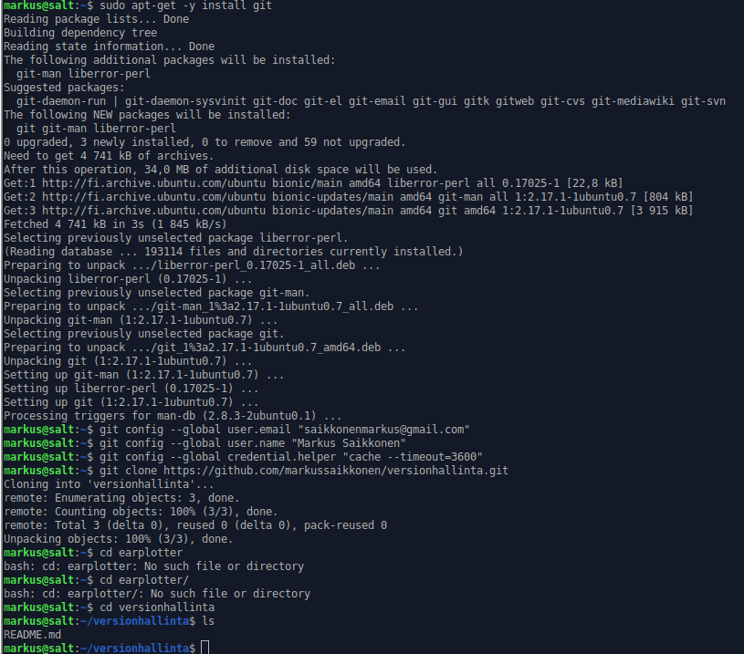
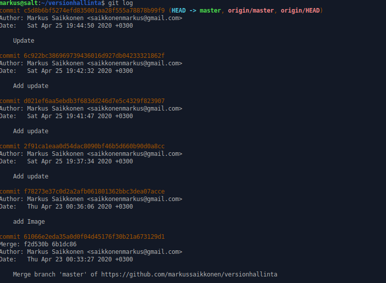
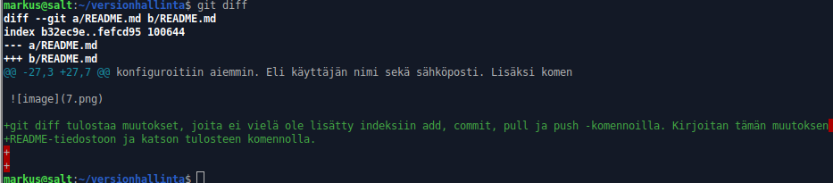
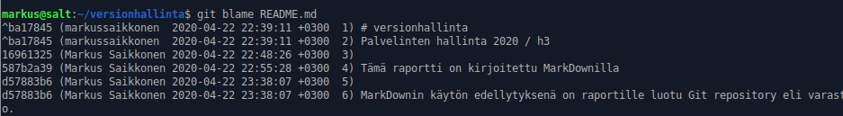
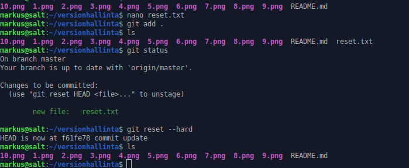

# versionhallinta
Palvelinten hallinta 2020 / h3

Tämä raportti on kirjoitettu MarkDownilla

MarkDownin käytön edellytyksenä on raportille luotu Git repository eli varasto. 
Käytin Linux-palvelimet 2020-kurssilla luomaani Git-tunnusta, jonne loin repositoryn "Versionhallinta".

Asensin gitin paikallisesti, konfiguroin omat käyttäjätiedot sekä salasana-asetukset 

"Kloonasin" Git-repositoryni terminaaliin $ git clone https://github.com/markussaikkonen/versionhallinta.git 
Muokkasin README.md-tiedostoa ja lisäsin muutokset Gittiin $ git add . && git commit; git pull && git push. Päivitin selaimen testatakseni tulokset

MarkDown ja Git toimivat onnistuneesti. 

# ‘git log’, ‘git diff’ ja ‘git blame’

Tarkastellaan ja testataan git-komentoja. git log antaa raportin commit-historiasta. Raportissa näkyy commitin käyttäjätiedot, jotka
konfiguroitiin aiemmin. Eli käyttäjän nimi sekä sähköposti. Lisäksi komento tulostaa kirjoitetun komennon sekä tarkan ajan.

git diff tulostaa muutokset, joita ei vielä ole lisätty indeksiin add, commit, pull ja push -komennoilla. Kirjoitan tämän muutoksen 
README-tiedostoon ja katson tulosteen komennolla.

git blame-komento on nimetty osuvasti raportoimaan rivin tarkkuudella kuka käyttäjä on tehnyt muutoksia. Komento tulostaa jokaisen
rivin muokanneen käyttäjän sekä tarkan ajankohdan. Lisäksi jokaisella ajakohdalla, jona muokkaus on tehty, on oma tunnus esim. d57883b6.

# Muutos gittiin

kokeilin git reset --hard komentoa, joka poistaa lisätyt muutokset, joita ei ole vielä commit-toiminnolla lisätty gittiin.
Loin komennon testausta varten git-kansioon reset.txt-tiedoston. Lisäsin muutoksen komennolla 'git add .' ja katsoin tuloksen 'git status'-komennolla ja näin, että muutos oli viellä committia vailla. Seuraavaksi käytin komentoa
git reset --hard. Komento antoi tulosteen "HEAD is now at f61f378 Update report", joka vaikuttaisi olevan alkutilanteen ID.
Katsoin kansiota ja näin reset.txt-tiedoston poistuneen. 

